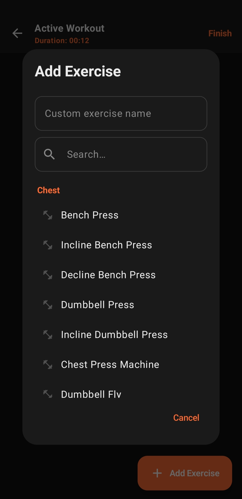
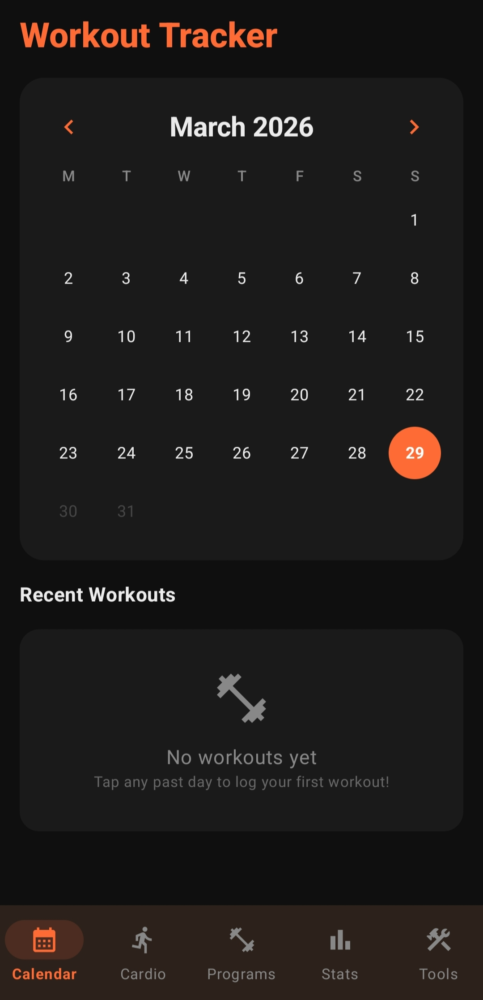
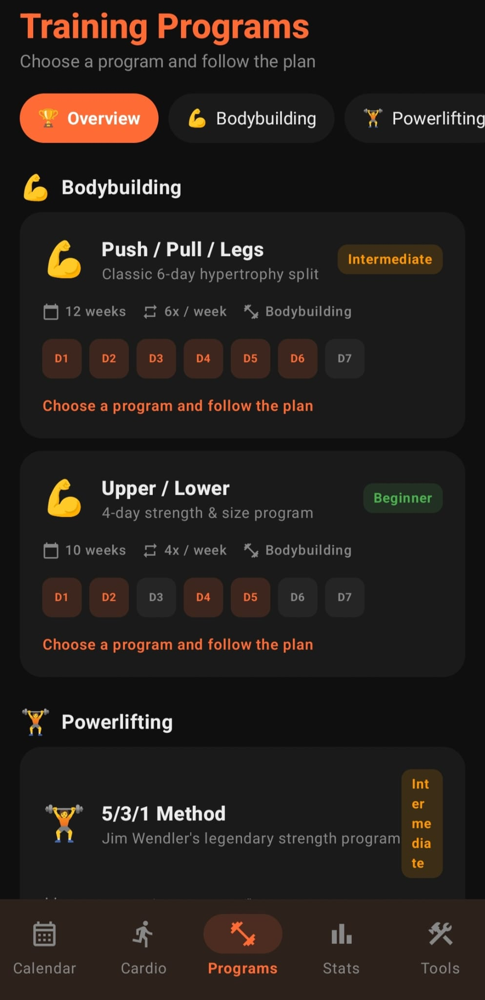
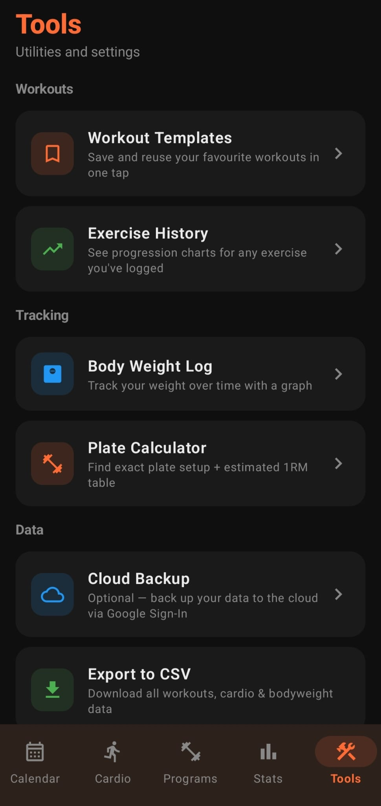

# 🏋️ Workout Tracker

A modern Android workout tracking application built with Kotlin, designed to help users log, manage, and track their workouts efficiently.

---

## 🚀 Features

- 📝 Create and manage workout sessions
- 💪 Track exercises and progress
- 💾 Local data persistence using Room
- ☁️ Optional cloud sync with Firebase (in progress)
- 🔐 Google account integration (optional)
- ⚠️ Input validation and error handling
- 💬 Feedback system included

---

## 📱 Screenshots

  
  
  
  

---

## 📦 Download

[Download APK v1.0.0](https://github.com/cr0sz/Workout-Tracker/releases)
---

## 🛠️ Tech Stack

- Kotlin
- Android SDK
- Room Database
- Firebase Authentication
- Cloud Firestore
- MVVM Architecture

---

## ⚙️ Installation

1. Download the APK from the Releases section
2. Enable "Install from unknown sources"
3. Install and launch the app

---

## 🧠 Architecture

The app follows **MVVM architecture** for clean separation of concerns:

- **Model** → Room database & data layer  
- **ViewModel** → Business logic & state management  
- **View** → UI (Activities / Fragments)

---

## 📡 Offline & Sync

- App works fully offline using Room
- Firebase sync is optional and currently under improvement

---

## 📌 What I Learned

- Android app architecture (MVVM)
- Local database management with Room
- Firebase integration basics
- Error handling & input validation
- Building and publishing a release APK

---

## 🔮 Future Improvements

- Improve Firebase cloud sync
- Add workout analytics / charts
- Better UI/UX polish
- Export / import workouts
- Dark mode improvements

---

## 👨‍💻 Author

**Bekir Akyüz**

- GitHub: https://github.com/cr0sz
- LinkedIn: https://www.linkedin.com/in/bekiraky%C3%BCz/

---

## ⭐ Support

If you like this project, consider giving it a star ⭐
