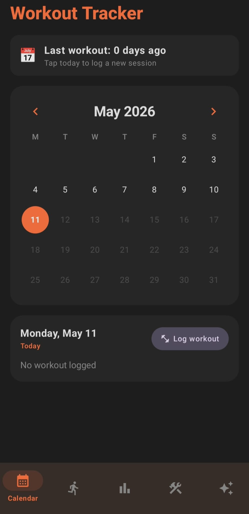
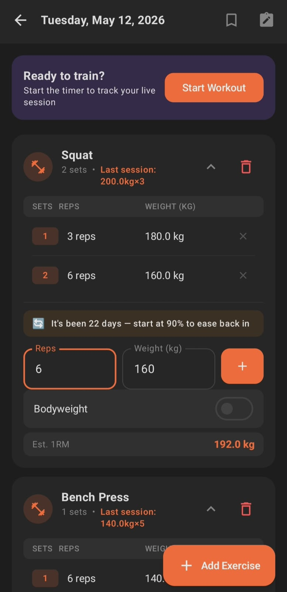
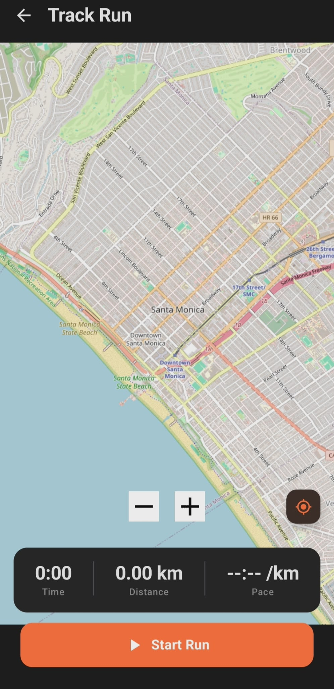
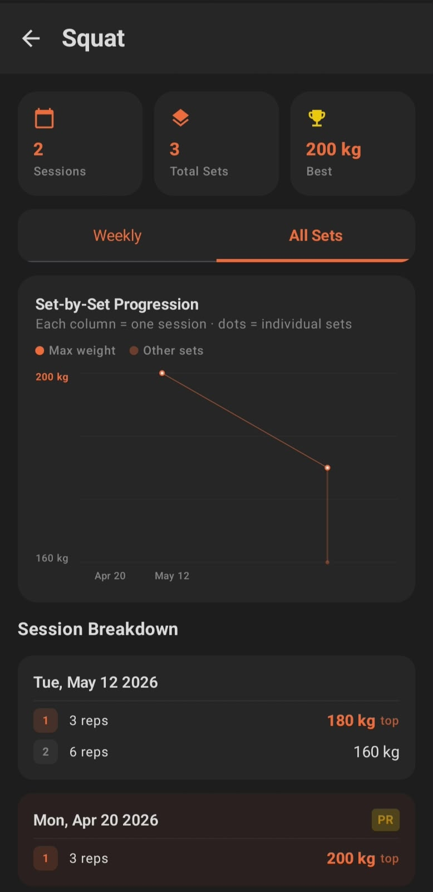
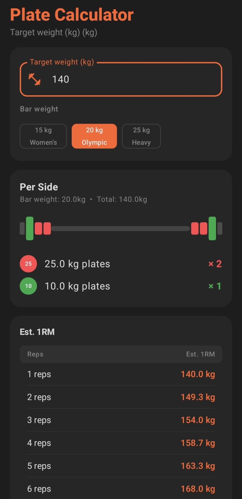
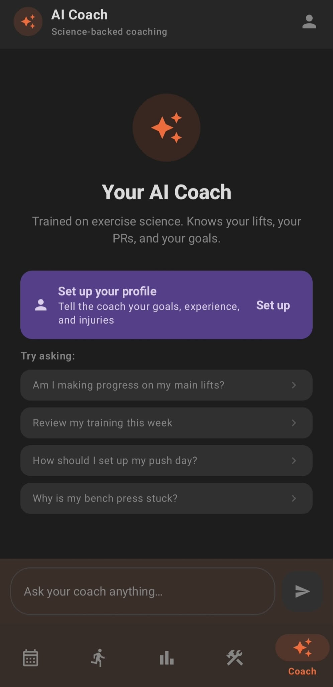

🏋️ Workout Tracker

An offline-first fitness tracking app for logging workouts, building programs, tracking progress, and getting AI-powered coaching based on your real training data.

Built with Kotlin (MVVM), Firebase, and a focus on speed, usability, and real gym workflows.

📥 Download

👉 Download APK v1.2

Enable “Install from unknown sources” on Android to install.

✨ Features
🏋️ Workout Logging
Log exercises with sets, reps, and weight
Bodyweight exercise support
Edit/delete individual sets
Workout notes per session
Smart progressive overload suggestions
Fast one-tap logging flow
📅 Programs & Templates
Built-in workout programs
Custom program builder (weekly splits)
Save workouts as reusable templates
Auto-advance program days
Structured training flow
🏃 Cardio Tracking
Manual cardio logging (distance, duration, calories)
Live GPS route tracking (OSMDroid)
Cardio history and performance trends
📊 Analytics & History
Personal records (PR tracking)
Volume progression over time
Muscle group heatmap
Exercise progression charts
Weekly workout stats & streak tracking
Full workout calendar view
🛠 Tools
Plate calculator (barbell loading assistant)
1RM calculator (Epley formula)
Bodyweight tracking with trend graphs
🤖 AI Coach
AI chat trained on your workout history
Personalized strength & hypertrophy advice
Goal-based recommendations
Multi-language support (EN, TR, DE, ES, FR)
☁️ Data & Sync
Fully offline-first (no internet required)
Firebase cloud sync (Google Sign-In)
CSV export/import for full data ownership
⚙️ Settings
Dark / light mode
kg / lbs toggle
Rest timer (30–180s)
Daily reminders
Onboarding flow
Language selection
📸 Screenshots

       

🧠 Architecture

MVVM Clean Architecture:

UI (Activities / Fragments)
        ↓
ViewModel (state + logic)
        ↓
Repository Layer
        ↓
Room DB (local) ↔ Firebase Firestore (cloud)
🛠 Tech Stack
Kotlin
MVVM Architecture
Room (SQLite)
Firebase Firestore
Firebase Auth (Google Sign-In)
OSMDroid (GPS maps)
Jetpack components
🚀 Build from Source
git clone https://github.com/cr0sz/Workout-Tracker.git

Then open in Android Studio:

Add google-services.json
Configure Firebase project
Add SHA-1 fingerprint in Firebase Console
Build & run
🧭 Roadmap
 Wear OS support
 Workout sharing system
 AI training split generator
 Advanced analytics dashboard
 Home screen widget for quick logging
⚡ Why this app
Fast logging (<2 seconds per set)
Fully offline usable
No subscription or paywall
Own your data (CSV export/import)
AI that understands YOUR progress
Built for real gym use, not casual fitness tracking
👤 Author

Bekir Akyüz
GitHub: https://github.com/cr0sz

LinkedIn: www.linkedin.com/in/bekirakyüz
